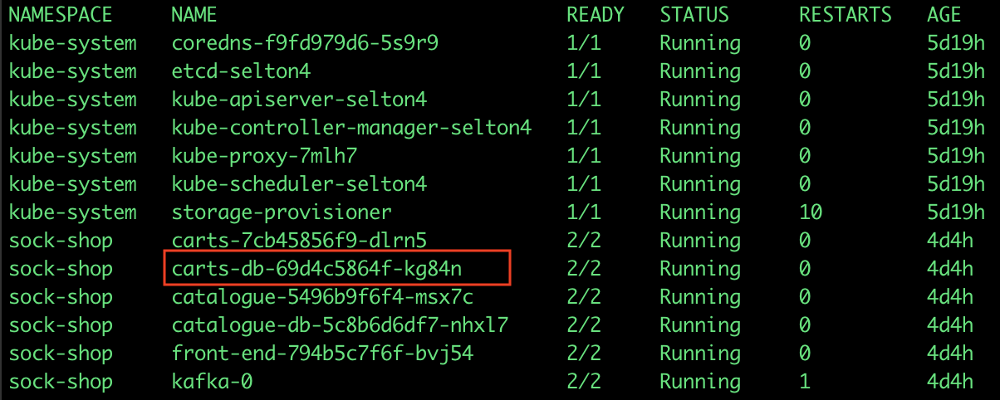

Debug and troubleshoot your microservices with an open source tool that enables you to view the complete API traffic inside of your Kubernetes cluster. 

Think TCPDump and Chrome Dev Tools combined.

## Key Features

* Simple and powerful CLI
* No installation or code instrumentation required
* Decode and present all HTTP requests, REST and gRPC API calls in real time
* Works completely on premises (on-prem)

## Quick Start
Get `mizu`:

- for **Mac** - 
```
curl -O https://static.up9.com/mizu/main/darwin.amd64/mizu && chmod 755 ./mizu
```

- for **Linux** - 
```
curl -O https://static.up9.com/mizu/main/linux.amd64/mizu && chmod 755 ./mizu
```


Run `mizu` and supply Kubernetes pod name to tap, for example:

```
mizu tap <podname> [-n <namespace>]
```

_Notes:_
- You should have `kubectl` configured to run against your Kubernetes cluster
- Namespace is required in case the pod is in a different namespace than the default one

View API traffic in real time by pointing your browser to [http://localhost:8899/](http://localhost:8899/) 


## Command-line Arguments
Usage and list of command-line arguments can be seen by running `mizu -h` or `mizu help`

```
Usage: mizu tap PODNAME [flags]

Flags:
  -p, --gui-port uint16     Provide a custom port for the web interface webserver (default 8899)
  -h, --help                help for tap
  -k, --kubeconfig string   Path to kubeconfig file
      --mizu-image string   Custom image for mizu collector (default "gcr.io/up9-docker-hub/mizu/develop:latest")
      --mizu-port uint16    Port which mizu cli will attempt to forward from the mizu collector pod (default 8899)
  -n, --namespace string    Namespace selector
  
Example: mizu tap front-end-794b5c7f6f-bvj54 -n sock-shop  
```

## Example: How to Get the Pod Name
```
kubectl get pods -A
```

```
mizu tap carts-db-69d4c5864f-kg84n -n sock-shop
```

---
version: 04
