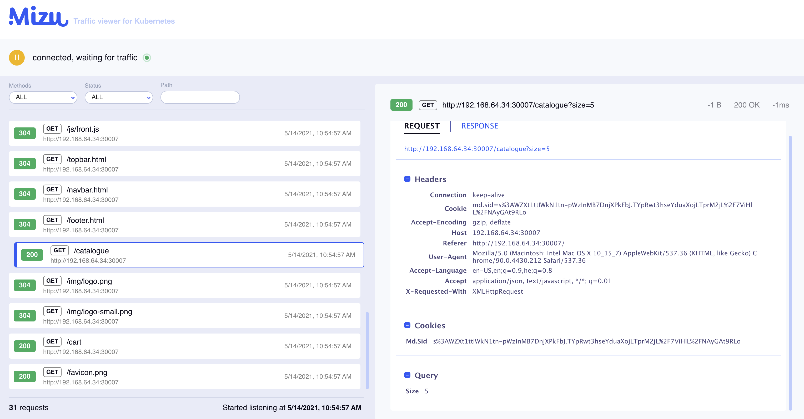
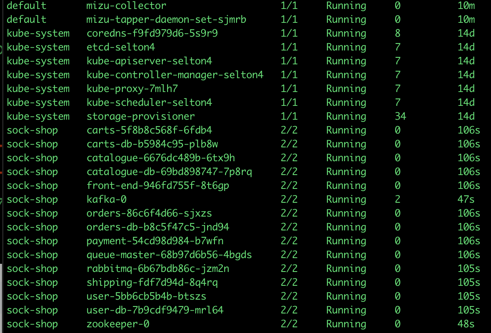

A simple-yet-powerful API traffic viewer for Kubernetes <br/>to help you troubleshoot and debug your microservices.

Think TCPDump and Chrome Dev Tools combined.

## Key Features

* Real-time view of all HTTP requests, REST and gRPC API calls
* Simple and powerful CLI
* No installation or code instrumentation
* `mizu` works completely on premises (on-prem)

## Quick Start
`mizu` is a <50MB program (written in Golang) that you can download and run.

Download `mizu`:

### Mac 
```
curl -O https://static.up9.com/mizu/main/darwin.amd64/mizu && chmod 755 ./mizu
```

### Linux 
```
curl -O https://static.up9.com/mizu/main/linux.amd64/mizu && chmod 755 ./mizu
```

Run `mizu` with a Kubernetes pod name, for example:

```
mizu tap <pod name>
```

_Notes:_
- You should have `kubectl` configured to run against your Kubernetes cluster

To see `mizu`'s standalone UI, point your browser to [http://localhost:8899/](http://localhost:8899/).



## Examples

Assuming this is my list of running pods:


View API traffic of a specific pod, identified by the pod name:
```
mizu tap catalogue-b87b45784-sxc8q
```
View API traffic of several pods, identified by a regular expression:
```
mizu tap "(catalo*|front-end*)"
```
The above command will observe the traffic of the following pods as their names match the regular expression:
- **catalo**gue-6676dc489b-6tx9h
- **catalo**gue-db-69bd898747-7p8rq
- **front-end**-946fd755f-8t6gp

View all API traffic:
```
mizu tap ".*"
```

---
version: 04
